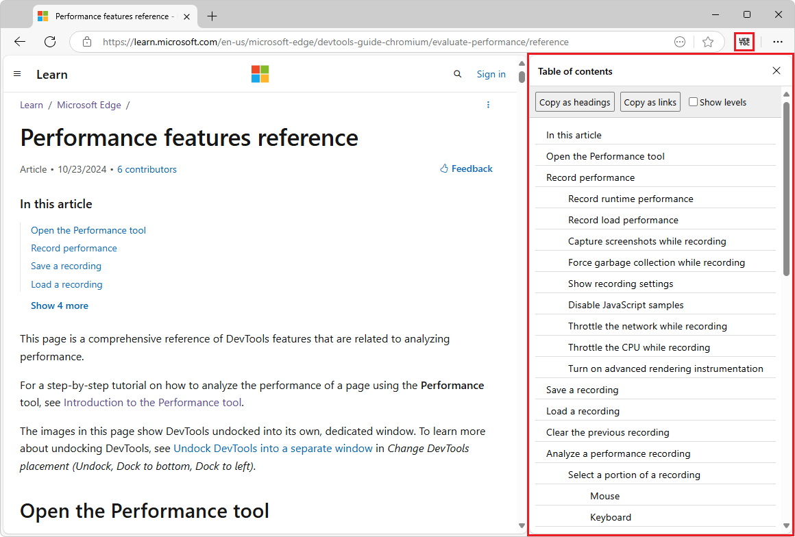

# WebToc - A table of contents extractor in your browser

WebToc is a browser sidebar extension that displays the detailed table of contents (TOC) outline for all webpages, in the sidebar as you surf the web.  The TOC reflects all headings in the current page.

WebToc is useful for page structure analysis and comparing webpages.  You can copy the TOC as Markdown headings, or as a list of Markdown links that you can paste in the `.md` file for a webpage as a **Contents** list.



**Contents:**
* [Install WebToc](#install-webtoc)
   * [Clone the WebToc repo to your local drive](#clone-the-webtoc-repo-to-your-local-drive)
   * [Install WebToc from the cloned repo](#install-webtoc-from-the-cloned-repo)
   * [Pin the WebToc button to the toolbar](#pin-the-webtoc-button-to-the-toolbar)
* [Use WebToc](#use-webtoc)
   * [Display the table of contents for the current tab](#display-the-table-of-contents-for-the-current-tab)
   * [Show the heading level number next to each heading](#show-the-heading-level-number-next-to-each-heading)
   * [Compare the TOCs of two webpages simultaneously](#compare-the-tocs-of-two-webpages-simultaneously)
   * [Copy the TOC as headings](#copy-the-toc-as-headings)
   * [Copy the TOC as links](#copy-the-toc-as-links)
* [Website-specific behavior](#website-specific-behavior)
* [See also](#see-also)

WebToc works in Microsoft Edge and Google Chrome.


<!-- ====================================================================== -->
## Install WebToc

Clone the WebToc repo, install WebToc from the cloned repo, and then pin WebToc next to the Address bar, as follows.


<!-- ------------------------------ -->
### Clone the WebToc repo to your local drive

Clone or download this repo to your local drive, as follows.

1. Click the **Code** drop-down button above (https://github.com/captainbrosset/WebToc).

1. Click the **Copy url to clipboard** button.

   The URL is copied to the clipboard: `https://github.com/captainbrosset/WebToc.git`

   Or, if you have GitHub Desktop installed, click **Open with GitHub Desktop** to clone the repo, and skip the command prompt step below.

   Or, you can use Visual Studio Code's **Source Control** pane to clone the repo, and skip the command prompt step below.

1. Assuming you have git installed, open a command prompt.

1. Clone the repo to your local drive, entering the URL string that you copied from the GitHub repo.  If you use a command prompt:

   ```Shell
   # example location where the repo directory will be added:
   cd c:/users/localAccount/github/
   git clone https://github.com/captainbrosset/WebToc.git
   ```

For details about cloning a repo, see:
* [Cloning a repository](https://docs.github.com/en/repositories/creating-and-managing-repositories/cloning-a-repository) - GitHub docs.


<!-- ------------------------------ -->
### Install WebToc from the cloned repo

To install WebToc in the browser from the locally cloned repo:

1. In Microsoft Edge, click **Settings and more** in the upper right, click **Extensions** , and then click **Manage extensions**.

   Or, in Chrome, click **Customize and control Google Chrome** in the upper right, click **Extensions**, and then click **Manage Extensions**.

   The **Extensions** tab opens.

1. Turn on the **Developer mode** toggle on the left (Microsoft Edge) or in the upper right (Chrome).

1. Click the **Load unpacked** button.

   The **Select the extension directory** dialog opens.

1. Navigate to your clone of the repo, such as:

   `C:\Users\localAccount\GitHub\WebToc\`

1. Click the **Select Folder** button.

   The extension is listed in the **Extensions** tab.

Next, pin the WebToc button to the toolbar, as follows.


<!-- ------------------------------ -->
### Pin the WebToc button to the toolbar

1. Open a new tab.

1. Close the **Extensions** tab.

1. In Microsoft Edge, click **Settings and more** in the upper right, click **Extensions**, and then to the right of **WebToc: Table of contents**, click the **Pin to toolbar** button.  Then click in a blank area to close the pop-up.

   Or, in Chrome, click the **Extensions** button to the right of the Address bar, and then to the right of **WebToc: Table of contents**, click the **Pin** button.  Then click in a blank area to close the pop-up.

   The **WebToc** () button is displayed to the right of the Address bar.


<!-- ====================================================================== -->
## Use WebToc

After WebToc is installed, use the tool as follows.


<!-- ------------------------------ -->
### Display the table of contents for the current tab

1. Go to a webpage, such as the present webpage.

1. If the **WebToc** () button is not shown to the right of the Address bar, see [Pin the WebToc button to the toolbar](#pin-the-webtoc-button-to-the-toolbar), above.

1. Click the **WebToc** () button to the right of the Address bar.

1. Go to a webpage.  

1. Refresh the webpage (**F5**).

   The TOC is displayed in the sidebar of the browser.

   All Markdown levels are displayed (h1-h6).

1. Click a heading in the table of contents to scroll to the heading in the page.


<!-- ------------------------------ -->
### Show the heading level number next to each heading


WebToc generates a table of contents from the h1 to h6 tags in the current page, and displays it in the sidebar.  It is useful for reviewing the content of long articles and documentation and quickly jumping around within a webpage.


<!-- ------------------------------ -->
### Compare the TOCs of two webpages simultaneously

To use WebToc to compare two pages in realtime, open the pages in two different browsers, such as Edge Stable and Edge Canary; see [Become a Microsoft Edge Insider](https://aka.ms/microsoftedge).

You can open two different browsers (such as Edge Stable, Edge Canary, or Chrome) side-by-side, and independently **Refresh** each browser.


<!-- ------------------------------ -->
### Copy the TOC as headings

You can copy the TOC as a Markdown headings outline.  The **Copy as headings** button creates a nested list of headings in Markdown, which you can use for general-purpose doc-design, such as comparing docs and re-outlining.

1. Click the **Copy as headings** button, and then paste into an editor, such as Visual Studio Code.


<!-- ------------------------------ -->
### Copy the TOC as links

You can copy as Markdown links and then paste a “Detailed contents” section at the top of an article.

The **Copy as links** button creates a nested list of anchor links, in Markdown format.

You can add the links to the top of a `.md` file as a **Detailed contents:** list.  This can be called a _webpage TOC_, or _article TOC_.<!-- _local TOC_, _partial TOC_ -->

1. Click the **Copy as links** button, and then paste into a .md file in an editor, such as Visual Studio Code.


<!-- ====================================================================== -->
## Website-specific behavior

For the following websites, WebToc omits the extra headings at top & bottom of the webpage:
* https://github.com - GitHub preview of .md files.
* https://learn.microsoft.com - Microsoft Dev docs.
   * https://review.learn.microsoft.com - Microsoft Dev docs review.
* https://developer.chrome.com - Chrome Dev docs.


<!-- ====================================================================== -->
## See also

* [Everything to know about browser extensions](https://www.microsoft.com/edge/learning-center/everything-to-know-about-browser-extensions?form=MA13I2&msockid=3078d2dac55660f53e4ec6a8c4ec61bf) - introduction for users.
* [Add, turn off, or remove extensions in Microsoft Edge](https://support.microsoft.com/microsoft-edge/add-turn-off-or-remove-extensions-in-microsoft-edge-9c0ec68c-2fbc-2f2c-9ff0-bdc76f46b026) - support steps for users.
* [Sideload an extension to install and test it locally](https://learn.microsoft.com/microsoft-edge/extensions-chromium/getting-started/extension-sideloading)
